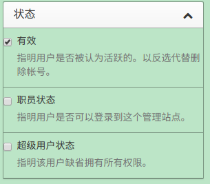
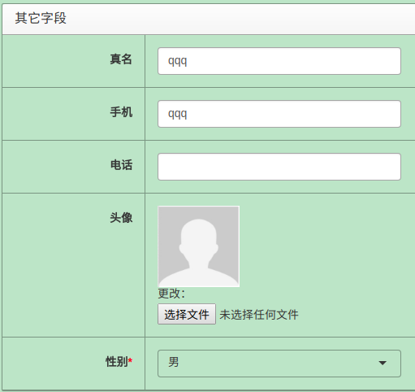
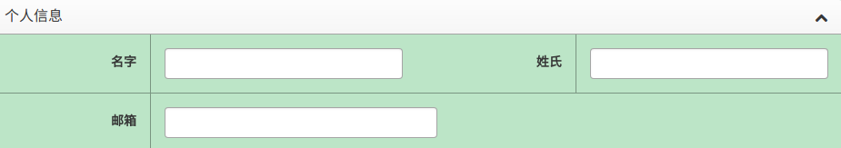
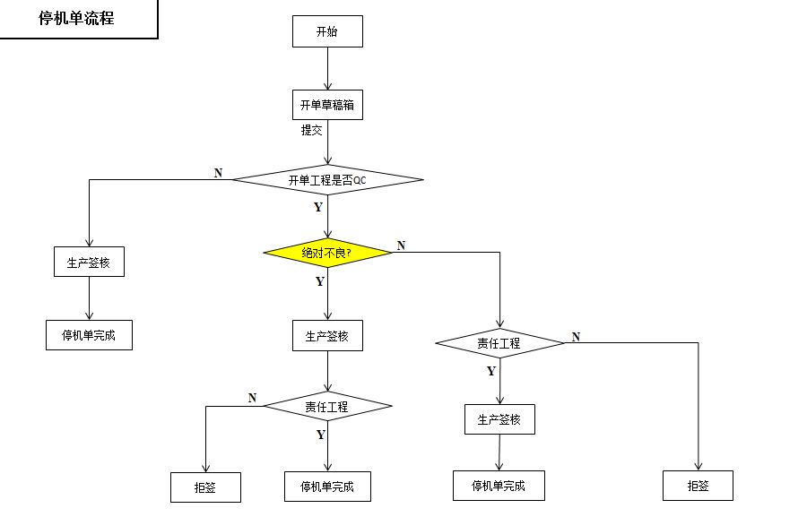
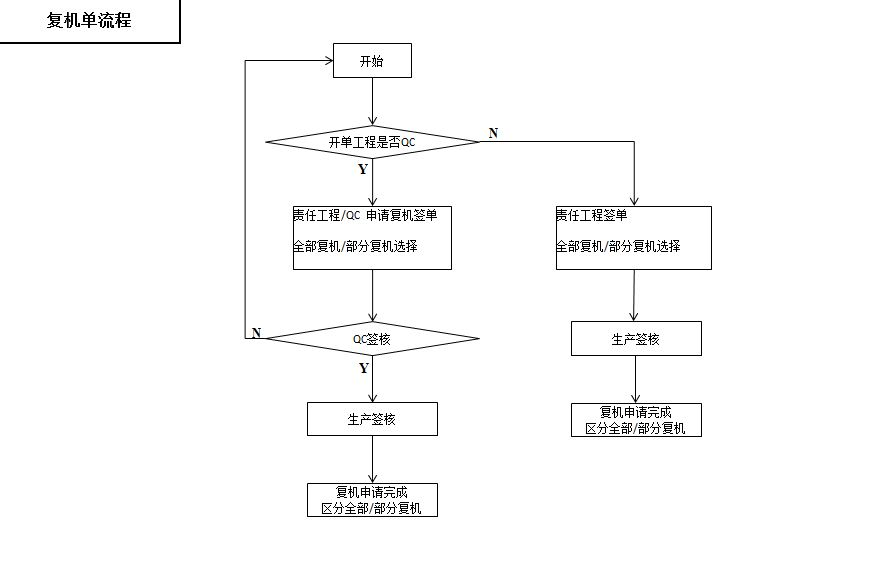
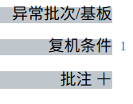

## 使用说明

[停机管理系统](http://10.53.141.252/)

[停机系统管理端](http://10.53.141.255/xadmin/)

停机管理系统的使用说明

## 用户管理

::: tip
用户和组是多对多的关系，即用户可以加入多个组。为避免不必要的麻烦，一个用户只加入一个组即可。

如果某用户加入了多个组，其在开单的时候，开单工程选择排序最靠前（不是最先加入）的那个组。但是权限验证时，会获取其加入的所有组的权限。
:::

::: warning
这个地方的设计增加了管理员的可定制化、灵活性等，但可能不是您想要的，解决方法就是一个用户最多加入一个组。
:::

### 状态

- 新增用户默认有效
- 超级用户即是管理员，建议只有一个即可
- 如果仍需要其他管理员，可以为其添加所需权限，而不是指定为超级用户

### 资料

请在其他字段中修改用户资料，个人信息中的**名字**、**姓氏**已被废弃

### 科室代码

科室代码千万不要修改，生产、QC 等科室的判定依赖这个

::: danger 禁止
如果必须要修改这个的话，代码也需要改动
:::

### 认证授权

- 组的名字可以修改（不建议）
- 不要新增或删除权限

### 日志记录

值得一提的是，管理界面的日至记录只是记录在**管理端**的操作。

### 关注 & 时间线

此功能仍是半成品，时间线记录用户在用户界面的操作

- 2 分钟内重复关注或取消关注同一人，不记录时间线
- 开单、审核等操作没有重复操作不记录的限制
- 时间线显示当前用户及其关注的人的动态

## 权限 & 其他说明

**在用户界面**，并不是所有的操作都需要验证权限。例如，有无 `添加关注` 的权限不影响关注别人。

**在管理界面**，权限针对的是某一类操作，而不是某一具体的操作。比如，您有 `停机审核` 的权限，可以审核所有的停机，而不是某个具体的停机单。在这里相当于直接操作数据库，没有任何流程的管控。

> 建议将权限赋予科室（组），将用户添加到相应的组下。系统将对用户以及其加入的所有组的权限作并集运算。（建议只加入一个组）

### 举个例子

- `查看：停机单` 管理端查看停机单，用户端不受影响
- `添加：停机单` 管理端、用户端开停机单的权限
- `修改：停机单` 管理端、用户端修改停机单的权限，在用户端另外还验证是否与开单人同一科室
- `删除：停机单` 管理端删除停机单的权限，用户端没有删除的功能

总结，如果您想要用户使用管理端，需要理解这四种权限。我们只建议超级管理员使用管理端，超级管理员默认拥有所有权限。对于用户端，只需要关注部分功能的 `添加`、`修改` 的权限即可。

::: danger 重要
为了实际操作中不那么复杂，如果您想某科室拥有开单的权限，就将停机单的四个权限全赋予其即可。
:::

> 下面的说明只针对用户端

### 开停机单

- 权限: `添加：停机单`
- 开单工程默认为用户加入的所有组的最靠前的那个

### 修改停机单

- 权限: `修改：停机单`
- 在开单工程组下
- 停机单无任何审核、复机记录

### 审核停机单

- 权限：`添加：停机签核`
- 权限：`修改：停机签核`

### 开复机单

- 权限：`添加：复机单`

### 修改复机单

- 权限：`修改：复机单`
- 和申请人有相同的组

### 审核复机单

- 权限：`添加：复机签核`
- 权限：`修改：复机签核`

### 生产批注

1. 开单、审核过程中: 无验证
2. 点击此处添加: `添加：生产批注`

